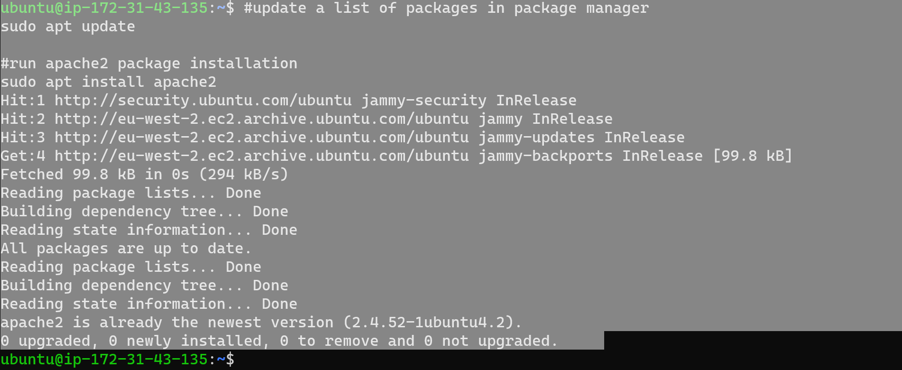
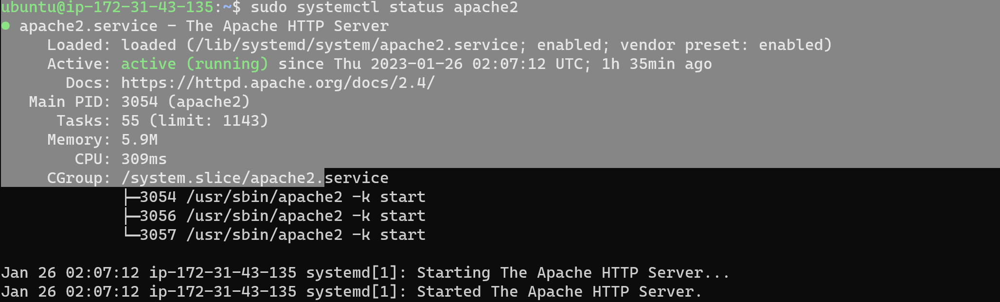

## Documentation of Project 1

**installation of apache and update of firewall**

`sudo apt update`

`sudo apt install apache2`

`sudo systemctl status apache2`

. [Installing Open SSH Server](https://learn.microsoft.com/en-us/windows-server/administration/openssh/openssh_install_firstuse?tabs=powershell)

. [Management of Open SSH Key](https://learn.microsoft.com/en-us/windows-server/administration/openssh/openssh_keymanagement)

. [Markdown guide](https://www.markdownguide.org/cheat-sheet/)

**installation of mySQL server**

`sudo mysql`

**installation of PHP**

`sudo apt install php libapache2-mod-php php-mysql`

